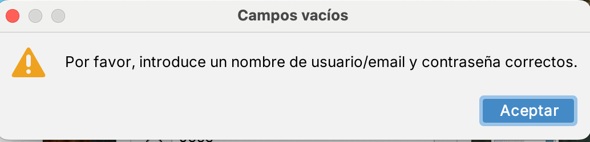
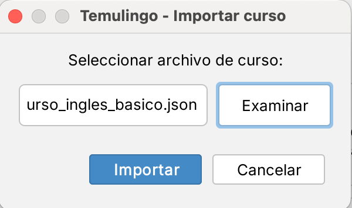
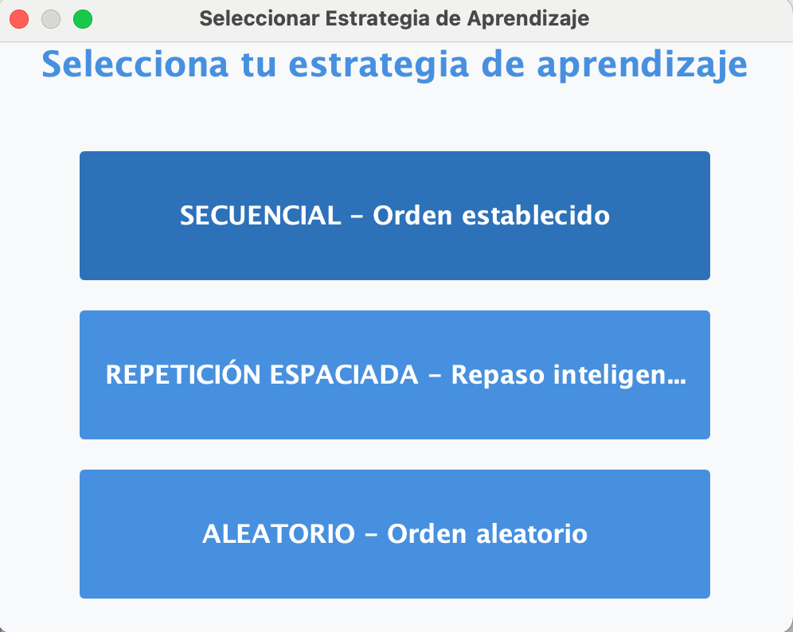
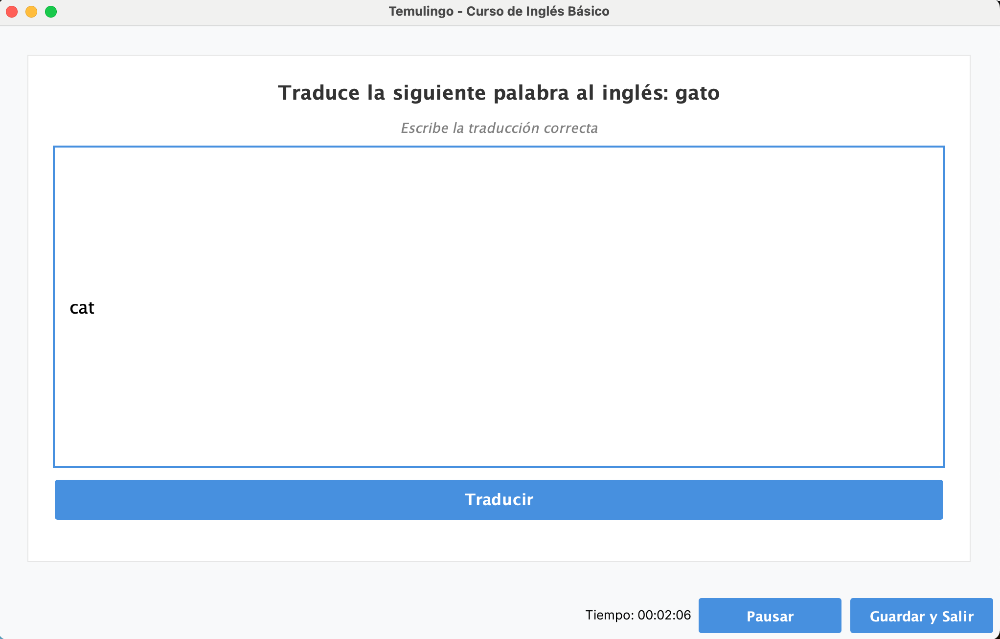
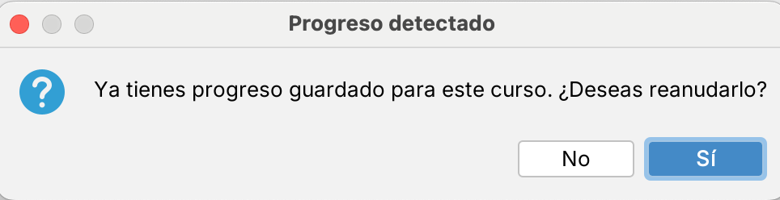
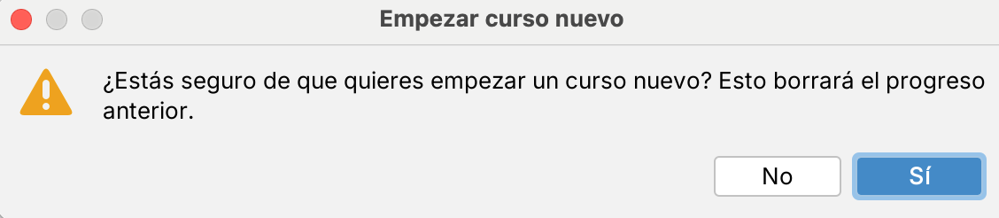
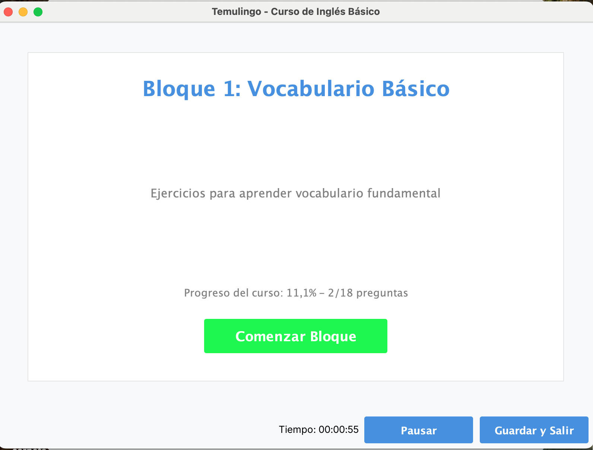

# Manual de Usuario
# Introducción
# Primeros pasos

## Pantalla de Bienvenida
Al iniciar Temulingo, verás una pantalla de inicio sesión en la que deberás introducir tu nombre de usuario y contraseña que deberías haber introducido previamente al registrarte.

## Registro de usuario
En caso de que sea la primera vez que inicies la aplicación, no tendrás ninguna cuenta creada con la que iniciar sesión, por lo que lo primero es que crees tu cuenta. Para ello, pulsa el botón "Crear cuenta" y se abrirá la siguiente ventana.

Los datos a introducir son: tu nombre completo, una cuenta de correo electrónico, el nombre de usuario que quieras, una contraseña que vayas a recordar y tu fecha de nacimiento. Si no introduces alguno de estos datos, se mostrará la siguiente advertencia, y deberás introducir los datos que falten.

## Inicio de sesión
Cuando tienes ya tu cuenta creada, rellena los campos con tus datos en la ventana de inicio de sesión y pulsa el botón de Login.

Si te falta algún dato se mostrará el aviso correspondiente para que puedas iniciar en la aplicación correctamente.

## Menú principal
La primera vez que inicies la aplicación, se mostrará la siguiente ventana principal, en la que podrás iniciar cursos, reanudarlos, ver tus estadísticas en la aplicación o importar cursos.

Como sería la primera vez, no verás más que la ventana con un mensaje dirigido a ti, y los botones para empezar a usar la app. En todo momento puedes cerrar la aplicación pulsando "Salir" en la parte inferior izquierda de la ventana.

## Estadísticas
Si no has iniciado ningún curso, las estadísticas se mostrarán vacías:

En caso contrario se mostrará con la información y datos pertinentes:

## Gestión cursos

### Importar curso
Lo primero será importar el curso que quieres realizar, pulsando el botón "Importar cursos" se te abre la ventana en la que podrás buscar por tus archivos el curso en cuestión:

Una vez que lo encuentres, lo seleccionas y le das a "Importar". Cuando cierres esta ventana, la ventana principal se actualizará con tu nuevo curso.

### Iniciar curso
Cuando tienes el curso, si quieres realizarlo pulsa "Iniciar" y se abrirá una ventana en la que podrás elegir entre las diferentes estrategias de aprendizaje:

- **Secuencial**: Se sigue el orden predefinido por las preguntas del curso
- **Aleatoria**: Las preguntas saldrán en un orden aleatorio  
- **Repetición espaciada**: Las preguntas se repetirán una vez cada 3 preguntas mientras queden preguntas nuevas

### Realización curso
Ahora que ya tienes elegido el orden de las preguntas, la aplicación te va a mostrar un panel informativo del bloque de preguntas que vas a ir contestando:

Cuando estés preparado para contestar, pulsa "Comenzar Bloque" y comenzarán a salirte las preguntas.

Como se puede observar, en la parte inferior de la ventana, se muestra el tiempo que llevas realizando el curso y varios botones:

- **"Pausar"**: Para pausar un momento el curso y reanudarlo enseguida sin salir
- **"Guardar y Salir"**: Te dejará guardar el progreso y volverás a la ventana principal

### Tipos de Ejercicios

#### Preguntas Tipo Test
En la ventana para las de tipo Test solamente tienes que elegir la opción que consideres y pulsar el botón "Responder":

Antes de pasar a la siguiente pregunta se mostrará tanto si has acertado como si no:

#### Preguntas de Traducción  
En Traducción se te pedirá que escribas la traducción de una palabra:

#### Rellenar Huecos
En Rellenar Huecos debes introducir la palabra que debería estar en el espacio en blanco:

### Reanudar Curso
En caso de que decidas pausar el curso y salir para continuar más tarde, cuando vuelvas a iniciar el curso, como antes, pulsando "Iniciar", si tienes un progreso guardado, mostrará los siguientes mensajes:

Se te indica claramente que ya tienes progreso y que si decides no continuar con el curso, perderás lo que has hecho y volverás a empezar el curso.

Si decides continuar con el curso, simplemente se mostrará la información del bloque en el que te has quedado, con el progreso que llevas:

Como antes debes darle a "Comenzar Bloque" para continuar.

### Finalización Curso
Cuando finalices un curso te saldrá la siguiente pantalla indicando que ya has completado el curso. 

